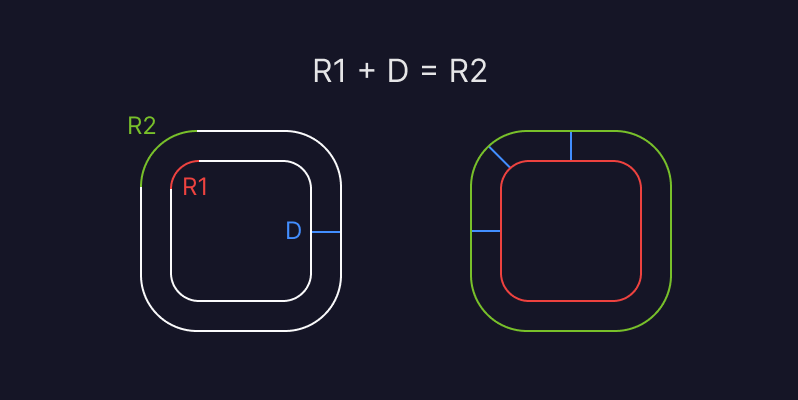

## Overview

### Desktop Screenshot

 

### Mobile Screenshot (iPhone 14 Plus)

 

### Links

- Solution URL: [Add solution URL here](https://your-solution-url.com)
- Live Site URL: [Add live site URL here](https://your-live-site-url.com)

## My process
- Worked with mobile layout first
- Develop the Desktop Version
- Researched features
- Cross-Browser Testing
- Tested responsiveness
- Compiled Readme 
### Built with

- Semantic HTML5 markup
- CSS custom properties
- Flexbox
- CSS Grid
- Mobile-first workflow


### What I learned

Learned fluid responsive. "font-size: calc(15px + 0.390625vw);" 

This formula calculates our font size as 15px plus 0.00390625% of the screen width. These values have been specifically chosen because they result in the perfect font sizes at every breakpoint:


```css
p {
        font-size: calc(15px + 0.390625vw);
    }
```

Learned nested border radius - Thanks to 30 Seconds Code for the guide!! [@username](https://github.com/30-seconds)

 


```css
.outer {
  border-radius: 24px;
  padding: 8px;
}

.inner {
  border-radius: 16px;
}
```

### Continued development

- Menu bar
- Incorporate into another project
- Change colours


### Useful resources

- [30secondsofcode](https://www.30secondsofcode.org/css/s/nested-border-radius/) - This helped me understand nesting border radius calculations
- [Matthew James Taylor](https://matthewjamestaylor.com/responsive-font-size) - This is an amazing article which helped me understand Fluid Responsive font size


## Acknowledgments

Dedicated to Jan and Dean. Thanks to The Odin Project, Northcoders and the resources on Frontend Mentor


